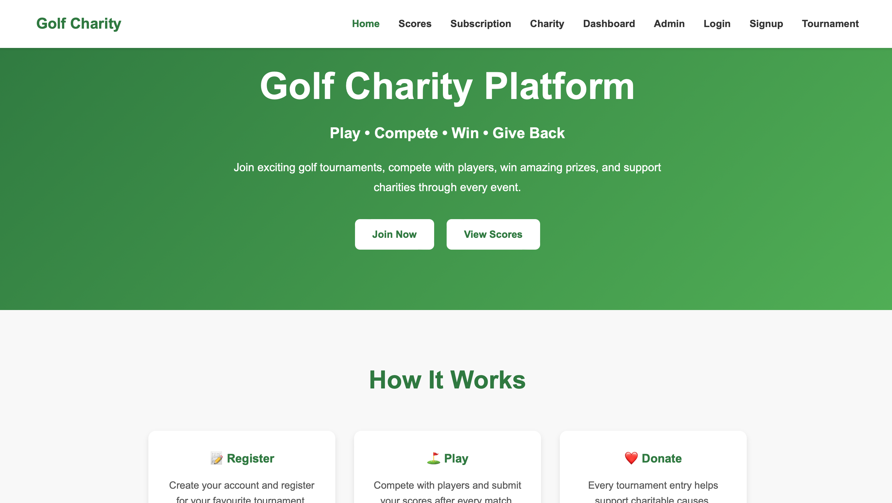
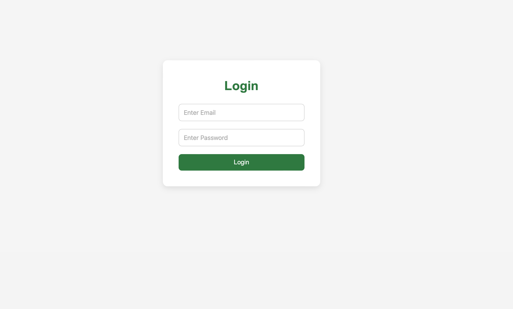
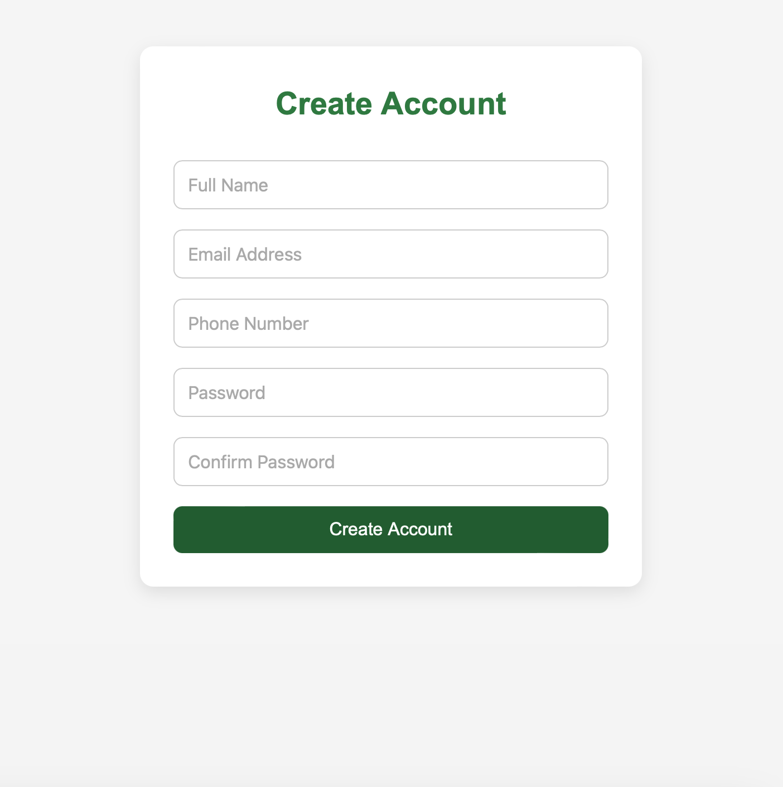
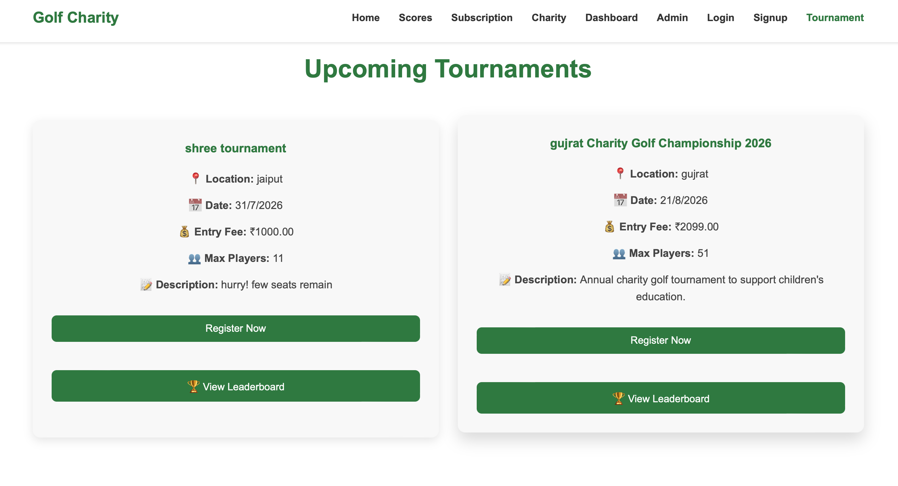
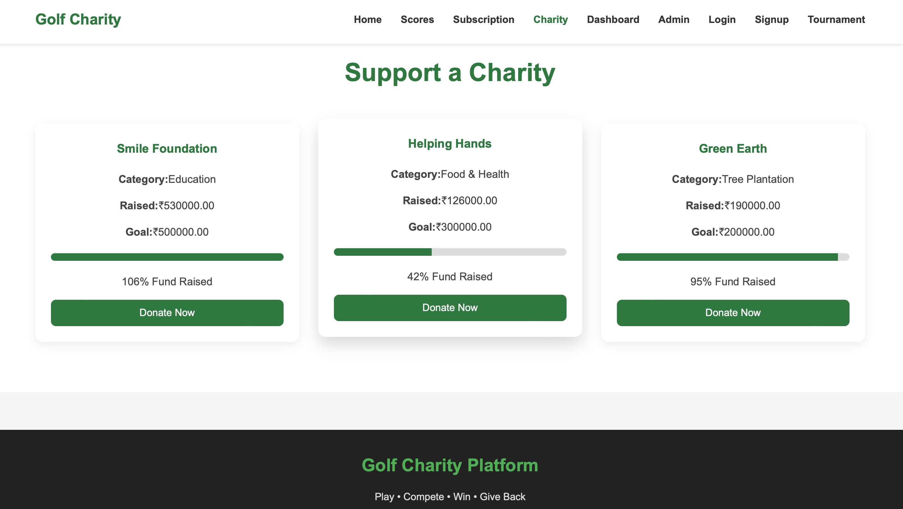
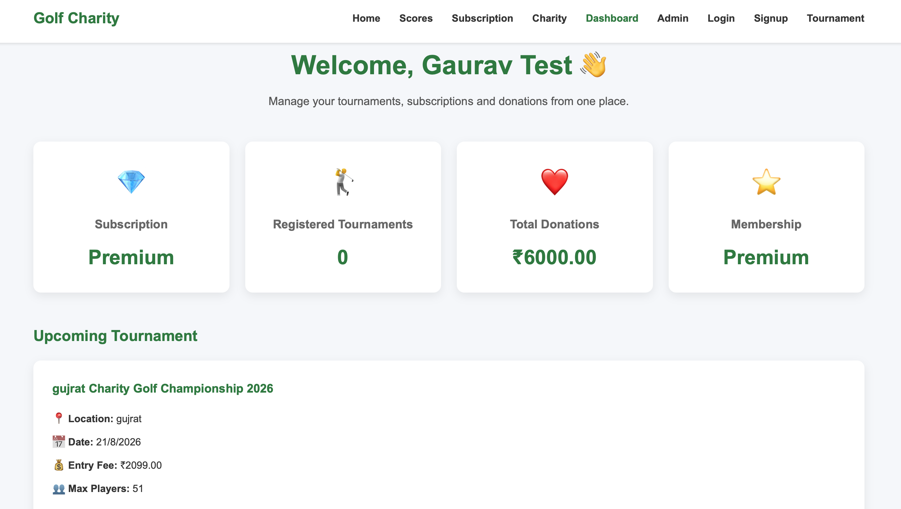

# Golf Charity Platform

A full-stack web application for managing golf tournaments, charity donations, subscriptions, and live leaderboards.

**Live Demo:**  
https://golf-charity-platform-21h3.vercel.app

**Backend API:**  
https://golf-charity-backend-wfru.onrender.com

---

## Overview

Golf Charity Platform is a full-stack web application developed to simplify golf tournament management while supporting charity initiatives.

The platform allows users to register, purchase subscription plans, participate in tournaments, track live scores, and donate to charitable causes. It also provides a dedicated admin dashboard for managing users, tournaments, donations, subscriptions, reports, and platform activities.

---

## Features

### User Features

- Secure User Authentication
- JWT Based Login System
- Subscription Plans
- Tournament Registration
- Live Tournament Scores
- Leaderboard
- Charity Donation
- User Dashboard
- Profile Management
- Change Password

### Admin Features

- Admin Dashboard
- User Management
- Tournament Management
- Donation Management
- Subscription Management
- Charity Management
- Reports & Analytics

---

## Tech Stack

### Frontend

- React.js
- Vite
- React Router DOM
- Axios
- CSS

### Backend

- Node.js
- Express.js
- JWT Authentication
- bcrypt.js

### Database

- MySQL

### Deployment

- Frontend → Vercel
- Backend → Render
- Database → Railway

---

## Folder Structure

```text
Golf Charity Platform
│
├── client
│   ├── src
│   ├── assets
│   ├── components
│   ├── layouts
│   ├── pages
│   ├── services
│   └── styles
│
├── server
│   ├── config
│   ├── controllers
│   ├── middleware
│   ├── models
│   ├── routes
│   └── app.js
│
└── golf_charity_db.sql
```

---

## Installation

Clone the repository

```bash
git clone https://github.com/gaurav-dwivedi995/golf-charity-platform.git
```

Frontend

```bash
cd client
npm install
npm run dev
```

Backend

```bash
cd server
npm install
npm start
```

---

## Environment Variables

Create a `.env` file inside the `server` directory.

```env
DB_HOST=your_database_host
DB_PORT=your_database_port
DB_USER=your_database_username
DB_PASSWORD=your_database_password
DB_NAME=your_database_name

JWT_SECRET=your_secret_key

PORT=5000
```

---

## Authentication

The application uses **JWT (JSON Web Token)** for secure authentication.

Features include:

- User Registration
- Secure Login
- Password Hashing using bcrypt
- Protected Routes
- Token Verification
- Role-based Authorization

---

## API Modules

| Module | Endpoint |
|---------|----------|
| Authentication | `/api/auth` |
| Tournament | `/api/tournament` |
| Registration | `/api/registration` |
| Subscription | `/api/subscription` |
| Donation | `/api/donation` |
| Dashboard | `/api/dashboard` |
| Charity | `/api/charity` |
| Reports | `/api/report` |
| User | `/api/user` |
| Admin | `/api/admin` |

---

## Database

Database used in this project:

- MySQL

Major tables include:

- users
- tournaments
- registrations
- subscriptions
- donations
- charity
- scores

---

## Project Workflow

```text
User
   │
   ▼
Frontend (React + Vite)
   │
Axios API Calls
   │
   ▼
Backend (Node + Express)
   │
JWT Authentication
   │
   ▼
MySQL Database
```

---

## Screenshots

### 🏠 Home Page



---

### 🔐 Login Page



---

### 📝 Signup Page



---

### ⛳ Tournament Page



---

### ❤️ Charity Page



---

### 👤 User Dashboard



---

## Future Improvements

- Payment Gateway Integration
- Email Verification
- Forgot Password
- Tournament Notifications
- Mobile Responsive Enhancements
- Advanced Dashboard Analytics
- Stripe / Razorpay Integration
- Admin Charts
- Email Notifications
- Profile Image Upload

---

## Author

**Gaurav Dwivedi**

B.Tech – Artificial Intelligence & Data Science

GitHub: https://github.com/gaurav-dwivedi995

---

## License

This project is developed for educational and portfolio purposes.

---

## Acknowledgements

Special thanks to all open-source libraries and tools used in this project.

- React
- Vite
- Node.js
- Express.js
- MySQL
- JWT
- Axios
- Railway
- Render
- Vercel

---

## Contact

For any queries or suggestions, feel free to connect.

GitHub:
https://github.com/gaurav-dwivedi995

---

If you found this project useful, consider giving it a ⭐ on GitHub.
